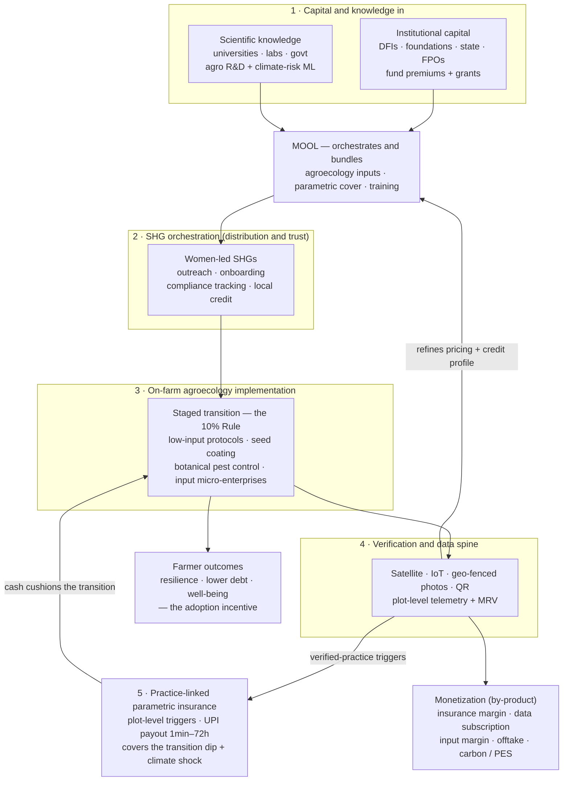
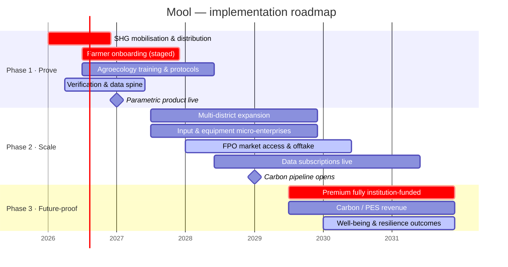

# Mool — Stakeholder Memo (Problem & Business Model)

<aside>
🌱

**Mool makes climate-resilient farming the rational choice for smallholder farmers.** We move farmers onto climate-resilient, low-input agriculture and use parametric insurance to de-risk the transition — turning resilience from a gamble into the safe, rational choice.

</aside>

*This is a working overview shared for your feedback. Open questions are flagged at the end — your input on those is exactly what we're after.*

## The problem: two traps that compound each other

Smallholder farmers grow roughly a third of the world's food yet sit behind a **≈$228B/yr financing deficit**. Excluded from formal finance and exposed to a volatile climate, they are caught between two loops that reinforce each other.

<aside>
🔁

**The debt trap**

- No land title, no credit history → shut out of formal lending and insurance
- Fall back on informal credit at 24–36%
- A climate shock destroys the crop
- Can't repay → debt rolls over and deepens
</aside>

<aside>
🌾

**The unsustainability trap**

- Degraded soil, low resilience
- Pressure for short-term output → nutrient mining, heavy synthetic inputs
- No coping capacity or support when shocks hit
- The next shock lands harder
</aside>

Each loop feeds the other: debt forces short-term extraction, extraction erodes resilience, and every climate shock tightens both.

**Vidarbha, Maharashtra — the acute end of this:**

- Maharashtra carries India's highest farmer-suicide burden (4,248 in 2022).
- In 2023–24, 165 of 385 sub-districts were drought-hit; ≈60% of affected farmers received no PMFBY payout.
- The state has delayed ≈₹1,015 Cr in premium subsidy in 2023-24.
- PMFBY settles at the block level, where basis risk runs ≈0.3 correlation — vs. the 0.6–0.8 achievable with plot-level data.

## The insight: sell resilience, not just harm-reduction

Insurance and grants traditionally pay a farmer *after* they've already lost — it manages decline. The durable fix is to move farmers onto climate-resilient, low-input practices that rebuild soil, cut input debt, and raise long-term resilience.

But that transition has a cost: a **15–20% yield dip during the transition years** that a farmer on the edge cannot absorb.

So Mool leads with the agroecology transition and positions **parametric insurance as the de-risker** — the cover that carries farmers through the transition dip and climate shocks. The primary adoption incentive is **well-being** (better health, less debt, women's empowerment), not yield.

## The solution: an ecosystem, not a single product

Mool operates as the orchestrator of an ecosystem that aligns the climate, the farmer, and institutions:

- **Community mobilization through SHGs** — women-led collectives are the distribution and trust layer. Adoption is framed as a family well-being program; SHGs handle outreach, compliance tracking, and local credit management.
- **Agroecology transition** — low-/zero-synthetic-input protocols (seed coating, botanical pest repellents), farmer training, and input & equipment micro-enterprises, staged onto ≈10% of a farmer's land first (the "10% Rule") to cap downside.
- **Practice-linked parametric insurance** — premium and cover linked to verified practice adoption, with plot-level triggers and fast UPI payouts (target 1 min–72 hr) covering the transition dip and climate shocks.
- **Verification & data spine** — remote sensing / IoT, satellite imagery, geo-fenced time-stamped photos, and QR traceability drive triggers, MRV, data products, and carbon.
- **Market access** — FPO-routed direct offtake and certified chemical-free premium sales, verified by QR-code traceability.

*How to read it: capital and knowledge fund the bundle, SHGs deliver and hold the trust relationship, farmers transition on ≈10% of their land first, and the verification layer does double duty — triggering the payouts that protect the transition and feeding Mool's pricing, data products, and revenue. Well-being pulls farmers in; monetization is the exhaust, not the goal.*

**Implementation order — the same components, sequenced over time**

## How we deploy: a phased model

Rather than launch a finished product, Mool scales the ecosystem in three phases. The through-line is the **funding curve**: institutions (local foundations first, then DFIs and state schemes) cover a rising share of the premium — from a partial subsidy in Phase 1 to **100% by Phase 3** — while farmers move toward being debt-free.

| Phase | FUNDING STACK - who is paying for insurance premium, input, operations | Core activities | Revenue sources |
| --- | --- | --- | --- |
| **Phase 1 — Prove** (beachhead) | Blended institutional stack (DFIs, state schemes, FPOs) in loans and grants. Farmers pay little to nothing. |   • Stand up women-led SHG distribution
  • Onboard farmers on ≈10% of land (the "10% Rule")
  • Agroecology training + low-input protocols
  • Deploy satellite / photo / QR verification
  • Launch practice-linked parametric product |   • Thin insurance margin
  • Early data subscriptions
  • Input margin |
| **Phase 2 — Scale** | Blended institutional stack (DFIs, state schemes, FPOs) funds a majority of the premium; 
Commercial financing as outcomes verify. |   • Expand acreage + practice depth
  • Input & equipment micro-enterprises
  • FPO-routed market access + certified offtake
  • Multi-institution partnerships |   • Growing insurance + data subscription
  • Input margin
  • Certified premium offtake
  • Early carbon pipeline
  • Early advisory services |
| **Phase 3 — Future-proof** (100%) | 100% of the premium is funded by the village level foundations. Farmers effectively debt-free. |   • "Future-proofing": farmer well-being, education, jobs, women's empowerment
  • Mature agroecology system
  • Deep MRV |   • Carbon credits / PES
  • Export-compliance-driven offtake
  • Data subscription (primary commercial lines)
  • Advisory Services |

## Business model & unit economics

Revenue comes from several value streams stacked on each acre; the mix shifts across phases as farmer-facing credit lines give way to institution-funded and commercial lines.

- **Insurance margin** — Mool's cut of the parametric premium.
- **Data subscription** — commercial + research access to plot-level datasets.
- **Input margin** — margin on the certified input & equipment bundle.
- **Market / offtake** — margin on certified chemical-free produce sold through FPO channels.
- **Carbon / PES** — deferred upside; voluntary market outside India.

As an early-stage reference (S/SE Asia), per-acre economics land at **≈$32/acre/yr**, roughly balanced across insurance, data, and input margins — with loan origination deprioritized to Phase 1 and carbon treated as later-phase upside.

## Funding thesis

Mool follows a blended-finance sequence already proven in Indian agroecology at scale: **grant → concessional loan → results-based financing → carbon.**

- **Precedent:** Andhra Pradesh's APCNF program assembled a ≈₹1,955 Cr stack — central schemes ≈36%, a KfW concessional loan ≈41%, a KfW academy grant ≈9%, philanthropy ≈14%. Kshema, the closest commercial analog, raised $20M from the GCF in 2025.
- **Vidarbha rails:** POCRA II ($490M), SMART ($210M), NABARD Green Impact Fund (₹1,000 Cr) + Carbon Fund (₹300 Cr), and the MahaAgri-AI policy (₹500 Cr, grants up to ₹2 Cr).
- **Carbon** is deferred and targets the voluntary market outside India (methodologies VM0042 and Boomitra).

## Market

| Tier | Serviceable acres | Market size | Model |
| --- | --- | --- | --- |
| **Beachhead (Yr 1)** | 100K | ≈$3.2M | NBFC / MFI + FPO clusters, S/SE Asia; orchestrator |
| **Addressable** | 50–70M | ≈$2.2B | Broader S & SE Asia; multi-partner, credit bureau, full license |
| **Total** | 600M | $30–50B | Global uninsured smallholder market |

Parametric crop insurance is growing **15–20%/yr**. Expansion runs bottom-up: acre × distribution reach × lateral product expansion.

## Competitive positioning

The whitespace is **practice-linked pricing delivered through an embedded financial product** — not data alone, and not practice-agnostic insurance. Mool sits in that corner.

| Player | What they are | Position vs. Mool |
| --- | --- | --- |
| **Kshema** | Licensed crop insurer; ≈$20M GCF (2025) | Closest analog — owns the insurer layer, but practice-agnostic |
| **Pula** | B2B2C; bundles insurance into inputs; 15M+ farmers | Strong distribution archetype; practice-agnostic |
| **DeHaat** | Full-stack agritech (≈$222M raised) | Adjacent full-stack benchmark; not insurance-led |
| **SatSure** | Satellite data & credit scoring (≈$28M) | Data-only layer — a potential supplier, not a competitor |
| **InRisk Labs** | Parametric-only infrastructure | Most product-adjacent; infra / upstream, not farmer-facing |
| **IBISA** | Blockchain / mutual (DHAN People's Mutual) | Mutual model; practice-agnostic |

## Why Vidarbha for the pilot

- **Documented, acute distress** — the evidence base above.
- **A finance gap with data still available** — PMFBY's shortfalls are well recorded, and the loss data needed to build better triggers is accessible.
- **R&D legacy** — ICAR-CRIDA and POCRA provide a local agronomy and climate-adaptation foundation.
- **Biodiversity & carbon overlay** — regenerative practice plus the tiger-corridor landscape strengthens the carbon / PES and impact story.
- **Distribution scaffolding** — POCRA, AgriStack, MAGNET, and MAVIM (SHG rails) lower the cost of reaching farmers.
- **Backtest design** — Taluka level, 2020–2024, Kharif primary, six consistently distressed districts, PMFBY as baseline; the edge is plot-level data + a better trigger formula.

## Open questions — where we want your feedback

- **Premium payers:** which institutions are most realistic to anchor Phase 1 — local foundations, state schemes (POCRA / SMART), or DFIs?
- **Commercial demand:** willingness to pay for plot-level data subscriptions and for certified / carbon offtake among research and corporate buyers.
- **SHG partnerships:** best routes into women-led collectives in Vidarbha (MAVIM / UMED, WOTR, others).
- **Regulatory path:** MGA vs. partnering with a licensed insurer (the Kshema model) for the insurance layer.
- **Results-based financing:** appetite for tying disbursement to verified adoption outcomes.

<aside>
📩

If any of these land in your area, we'd value a short conversation. Pushback on the model is as useful to us as endorsement.

</aside>